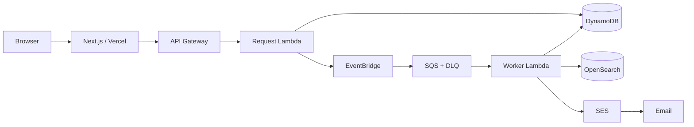

# Serverless Dining Concierge
video link - https://youtu.be/xghHX1KSuSk
A full-stack, event-driven restaurant recommendation application built for a software-engineering portfolio. The frontend is a **Next.js** app designed for **Vercel**, while the backend uses **AWS API Gateway, Lambda, EventBridge, SQS, DynamoDB, OpenSearch, and SES**.

The app accepts a location, cuisine, date, time, party size, and email. It validates the request, queues it asynchronously, finds restaurant recommendations, stores the result, and optionally emails the recommendations.

## Architecture



See [`architecture.md`](architecture.md) for the request lifecycle and reliability decisions.

## Features

- Next.js responsive frontend ready for Vercel
- API Gateway REST endpoints
- Lambda request validation and NYC location normalization
- EventBridge → SQS asynchronous processing
- SQS dead-letter queue and retry behavior
- DynamoDB request status/history with TTL cleanup
- Optional AWS OpenSearch restaurant lookup
- Safe bundled-data fallback when OpenSearch is not configured
- Optional Amazon SES recommendation email
- Frontend polling for asynchronous completion
- Portfolio demo mode that works on Vercel even before AWS is connected
- Pytest backend tests and GitHub Actions CI

## Repo structure

```text
dining-concierge/
├── frontend/                   # Next.js app → Vercel
├── backend/
│   ├── template.yaml           # AWS SAM infrastructure
│   ├── samconfig.toml
│   ├── src/
│   │   ├── common/
│   │   ├── request_handler/
│   │   └── worker/
│   └── tests/
├── scripts/
│   └── seed_opensearch.py
├── .github/workflows/ci.yml
├── architecture.md
└── README.md
```

## 1. Run the frontend locally

Requirements: Node.js 20+

```bash
cd frontend
npm install
npm run dev
```

Open `http://localhost:3000`.

With no `NEXT_PUBLIC_API_URL`, the UI automatically runs in **portfolio demo mode**. This lets you deploy the frontend first and connect AWS later.

## 2. Deploy the AWS backend

Requirements:

- AWS CLI configured with your account
- AWS SAM CLI
- Python 3.12

From the repository root:

```bash
cd backend
sam build
sam deploy --guided
```

For the first deployment, recommended answers are:

```text
Stack Name: dining-concierge
AWS Region: us-east-1
Parameter SesFromEmail: <leave blank initially>
Parameter OpenSearchEndpoint: <leave blank initially>
Parameter OpenSearchIndex: restaurants
Confirm changes before deploy: Y
Allow SAM CLI IAM role creation: Y
Save arguments to configuration file: Y
```

After deployment, SAM prints an `ApiUrl`. Copy that value.

## 3. Connect Vercel to AWS

Create `frontend/.env.local` locally:

```bash
NEXT_PUBLIC_API_URL=https://YOUR_API_ID.execute-api.us-east-1.amazonaws.com/Prod
```

Restart `npm run dev` and submit a dining request. The UI will now use the AWS asynchronous flow.

For Vercel:

1. Push this repository to GitHub.
2. Import it in Vercel.
3. Set **Root Directory** to `frontend`.
4. Add environment variable `NEXT_PUBLIC_API_URL` with the SAM `ApiUrl` output.
5. Deploy.

## 4. Enable SES email

SES requires a verified sender identity. New AWS accounts may also be in the SES sandbox, where recipients must be verified too.

Verify an email address in the SES console, then redeploy:

```bash
cd backend
sam deploy --parameter-overrides SesFromEmail=verified-sender@example.com OpenSearchEndpoint="" OpenSearchIndex=restaurants
```

If `SesFromEmail` is blank, the project still completes requests and shows recommendations in the UI; it simply skips email delivery.

## 5. Add OpenSearch (optional)

The backend is intentionally deployable **without** OpenSearch because managed OpenSearch can cost money. If `OpenSearchEndpoint` is blank, the worker uses the bundled restaurant dataset.

To enable real OpenSearch lookup:

1. Create or use an AWS OpenSearch domain.
2. Give the worker Lambda role permission to call the domain.
3. Install the seed-script dependencies:

```bash
python -m venv .venv
source .venv/bin/activate
pip install -r scripts/requirements.txt
```

4. Seed the sample restaurant index:

```bash
export AWS_REGION=us-east-1
export OPENSEARCH_ENDPOINT=https://search-your-domain.us-east-1.es.amazonaws.com
python scripts/seed_opensearch.py
```

5. Redeploy the backend with the endpoint:

```bash
cd backend
sam deploy --parameter-overrides OpenSearchEndpoint="$OPENSEARCH_ENDPOINT" OpenSearchIndex=restaurants SesFromEmail=""
```

## API

### `POST /recommendations`

```json
{
  "location": "Manhattan",
  "cuisine": "Indian",
  "date": "2027-06-10",
  "time": "19:30",
  "party_size": 2,
  "email": "demo@example.com"
}
```

Response:

```json
{
  "request_id": "...",
  "status": "QUEUED",
  "message": "Request accepted. Recommendations are being prepared."
}
```

### `GET /requests/{request_id}`

Returns `QUEUED`, `PROCESSING`, `COMPLETED`, or `FAILED` plus recommendations when complete.

## Tests

```bash
pip install pytest
pytest backend/tests -q
```

## Why this is useful as an SDE portfolio project

This project demonstrates more than a CRUD app:

- asynchronous/event-driven design
- queue-based decoupling and retry handling
- serverless APIs
- cloud data storage
- REST API design
- distributed request state
- failure handling and DLQ usage
- frontend/backend integration
- infrastructure as code with AWS SAM
- CI and automated tests
- production-aware cloud cost choices


## Cost note

Most components are usage-based and inexpensive for a small portfolio demo, but **managed OpenSearch can generate meaningful charges even at low traffic**. The repo therefore keeps OpenSearch optional and provides a bundled-data fallback. Review AWS pricing before creating paid resources.
