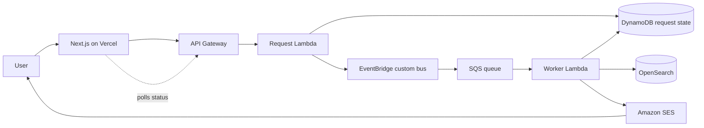

# Architecture

## Request lifecycle

1. The Next.js UI submits a dining request to API Gateway.
2. `RequestHandler` validates input, normalizes NYC locations, writes a `QUEUED` item to DynamoDB, and emits a `DiningRequestSubmitted` event.
3. EventBridge routes the event to SQS.
4. `DiningWorker` consumes SQS messages and queries OpenSearch. When OpenSearch is not configured, the worker uses bundled demo restaurant data so the stack remains deployable for portfolio/demo use.
5. The worker stores recommendations and completion state in DynamoDB and optionally sends them by SES.
6. The frontend polls `GET /requests/{request_id}` until the asynchronous request finishes.

## Reliability choices

- SQS decouples request acceptance from recommendation processing.
- A dead-letter queue captures jobs that fail three times.
- DynamoDB acts as durable request state and allows the UI to recover after refresh.
- EventBridge makes the request event extensible; additional targets can later consume the same event.
- The worker falls back to bundled restaurant data if OpenSearch is unavailable, which keeps the demo usable during cloud setup.
